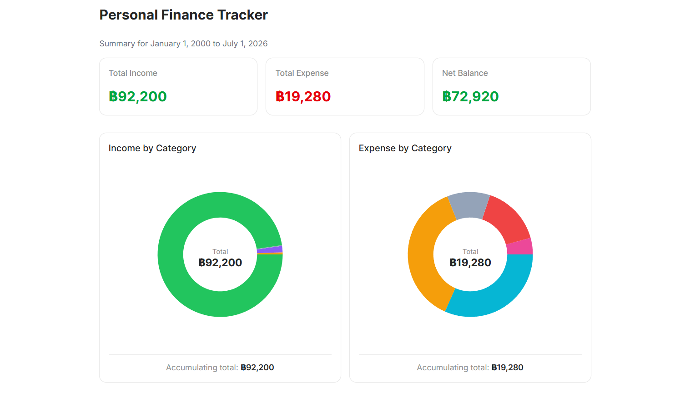

# Personal Finance Tracker

A full-stack web application for recording and tracking personal income and expense transactions. Features include transaction CRUD with pagination, filtering by type/category/date range, server-cached summaries via TanStack Query, donut chart category breakdown, and a delete confirmation dialog.

Built with a clean layered architecture (Route Handler → Service → Repository → Database).



## Tech Stack

| Layer | Technology |
|-------|-----------|
| **Framework** | Next.js 16 (App Router) |
| **Language** | TypeScript (strict mode) |
| **Database** | PostgreSQL 16 |
| **ORM** | Drizzle ORM v0.45 |
| **Validation** | Zod v4 |
| **Server State** | TanStack Query v5 |
| **Global State** | Zustand |
| **Styling** | Tailwind CSS v4 + shadcn/ui (`@base-ui/react`) |
| **Charts** | Recharts (code-split via `next/dynamic`) |
| **Testing** | Vitest v4 |

## Project Structure

```
personal-finance-tracker/
├── src/
│   ├── app/
│   │   ├── api/
│   │   │   ├── transactions/
│   │   │   │   ├── route.ts           # GET (list + pagination), POST (create)
│   │   │   │   └── [id]/
│   │   │   │       └── route.ts       # GET, PUT, DELETE by id
│   │   │   └── summary/
│   │   │       └── route.ts           # GET (totals + breakdown by date range)
│   │   ├── layout.tsx
│   │   ├── page.tsx                   # SSR with TanStack Query hydration
│   │   ├── loading.tsx                # Skeleton loading screen
│   │   └── globals.css                # Tailwind v4 + @theme config
│   ├── components/
│   │   ├── Dashboard.tsx              # Layout shell (no state)
│   │   ├── SummaryCards.tsx            # Income/expense/net cards
│   │   ├── TransactionForm.tsx         # Add/edit form (Zustand + mutations)
│   │   ├── TransactionList.tsx         # Paginated list with filters (queries)
│   │   ├── CategoryBreakdown.tsx       # Donut charts (code-split)
│   │   ├── providers.tsx               # QueryClientProvider
│   │   └── ui/                         # shadcn/ui primitives
│   │       ├── button, card, input, select
│   │       ├── badge, label, radio-group
│   │       ├── calendar, chart, dialog
│   │       ├── pagination, popover
│   ├── db/
│   │   ├── client.ts                  # PostgreSQL connection pool
│   │   └── schema.ts                  # Drizzle schema + enums
│   ├── hooks/
│   │   ├── use-transactions.ts        # useTransactions + CRUD mutations
│   │   └── use-summary.ts             # useSummary query
│   ├── lib/
│   │   ├── api-client.ts              # Unified apiRequest with AbortSignal
│   │   ├── categories.ts              # Single source of categories + colors
│   │   ├── errors.ts                  # AppError, ValidationError, NotFoundError
│   │   ├── format.ts                  # Currency/date formatters
│   │   ├── http.ts                    # handleError() -> AppError.toResponse()
│   │   ├── query-client.ts            # TanStack Query client factory
│   │   ├── query-keys.ts              # Query key factory
│   │   └── utils.ts                   # cn() (clsx + tailwind-merge)
│   ├── repositories/
│   │   └── transactionRepository.ts   # Drizzle queries + row mapper ($inferSelect)
│   ├── schemas/
│   │   └── transactionSchema.ts       # Zod v4 schemas (from<=to validated)
│   ├── services/
│   │   ├── transactionService.ts      # Transaction business logic
│   │   └── summaryService.ts          # Summary aggregation logic
│   ├── stores/
│   │   └── editing-store.ts           # Zustand store for editing state
│   └── types/
│       └── transaction.ts             # Domain types + PaginatedResult
├── tests/
│   ├── lib/format.test.ts
│   ├── schemas/transactionSchema.test.ts
│   ├── repositories/transactionRepository.test.ts
│   ├── services/transactionService.test.ts
│   └── services/summaryService.test.ts
├── drizzle/                           # Generated migrations
├── scripts/
│   └── migrate.mjs                    # Runtime migration script
├── AGENTS.md                         # Agentic coding instructions
├── docker-compose.yml
├── Dockerfile
└── package.json
```

## Architecture

```
Route Handler (HTTP) → Service (Business Logic) → Repository (Data Access) → Drizzle ORM → PostgreSQL
```

- **Route Handlers** (`src/app/api/`): Parse HTTP requests, delegate to services, map errors via `handleError()`. No business logic.
- **Services** (`src/services/`): Zod validation, cross-field rules (type↔category), error handling. Delegate data access to repositories.
- **Repositories** (`src/repositories/`): Raw Drizzle queries, `$inferSelect` row typing, `rowToTransaction()` mapper.
- **DB** (`src/db/`): Schema definitions (`schema.ts`) and connection pool (`client.ts`).
- **Hooks** (`src/hooks/`): TanStack Query wrappers with cache invalidation after mutations.
- **Stores** (`src/stores/`): Zustand stores for cross-component state (`editingTransaction`).

Error handling: `AppError` base class with `toResponse()`; `handleError()` collapses to ~3 lines.

## Database Schema

The `transactions` table stores amounts as `numeric(12, 2)` (supports decimals):

| Column | Type | Notes |
|--------|------|-------|
| `id` | UUID | Auto-generated primary key |
| `type` | enum | `income` or `expense` |
| `amount` | numeric(12,2) | 10 digits precision, 2 scale |
| `category` | text | Validated via discriminated union |
| `date` | date | Transaction date |
| `note` | text | Optional, nullable |
| `created_at` | timestamp | Auto-set |
| `updated_at` | timestamp | Auto-set, bumped on update |

Constraint: `amount > 0`

### Categories

Defined in `src/lib/categories.ts` (single source of truth):

| Type | Categories |
|------|-----------|
| Expense | food, utilities, entertainment, shopping, other |
| Income | salary, investment, gift, other |

## API Endpoints

| Method | Path | Query Params | Description |
|--------|------|-------------|-------------|
| GET | `/api/transactions` | `type`, `category`, `from`, `to`, `page`, `pageSize` | Paginated transaction list |
| POST | `/api/transactions` | — | Create a transaction |
| GET | `/api/transactions/:id` | — | Get a single transaction |
| PUT | `/api/transactions/:id` | — | Update a transaction |
| DELETE | `/api/transactions/:id` | — | Delete a transaction |
| GET | `/api/summary` | `from`, `to` | Totals + category breakdown |


## Prerequisites

- Node.js 18+
- Docker + Docker Compose (for containerized setup)
- Or a local PostgreSQL 16 instance

## Setup & Run

### Using Docker (recommended)

```bash
cd personal-finance-tracker
cp .env.example .env
docker compose up --build          # runs migrate + seed (if empty) + app
```

### Local Development

```bash
npm install
docker compose up postgres -d     # or use local PostgreSQL
cp .env.example .env
npm run db:migrate                 # run pending migrations
npm run db:push                    # push schema (dev only)
npm run db:seed                    # seed sample data (skips if already seeded)
npm run dev                        # starts with webpack (Turbopack has a Windows CSS bug)
```

## Available Commands

| Command | Description |
|---------|-------------|
| `npm run dev` | Start dev server (webpack) |
| `npm run build` | Production build |
| `npm run start` | Start production server |
| `npm run lint` | Run ESLint (flat config) |
| `npm run test` | Run Vitest in watch mode |
| `npm run test:run` | Run Vitest once |
| `npm run test:coverage` | Run Vitest with coverage |
| `npm run db:generate` | Generate Drizzle migration files |
| `npm run db:migrate` | Run pending migrations |
| `npm run db:seed` | Seed sample data (auto-skips if DB has data) |
| `npm run db:push` | Push schema directly (dev only) |

### Running a Single Test

```bash
npx vitest run tests/services/transactionService.test.ts
npx vitest run -t "test name pattern"
```
